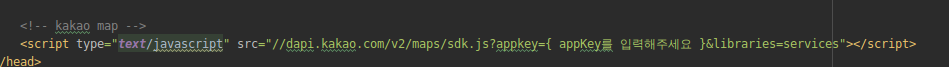
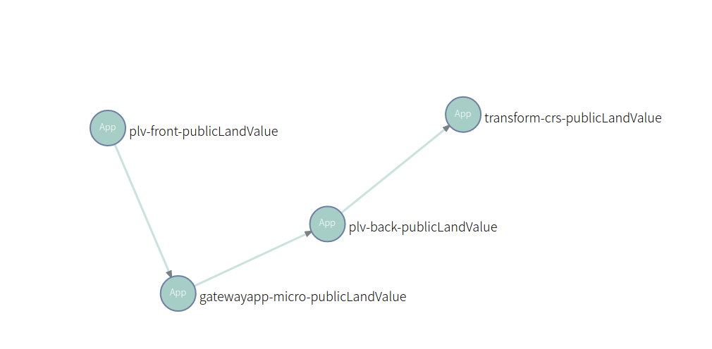
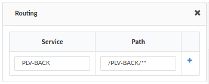
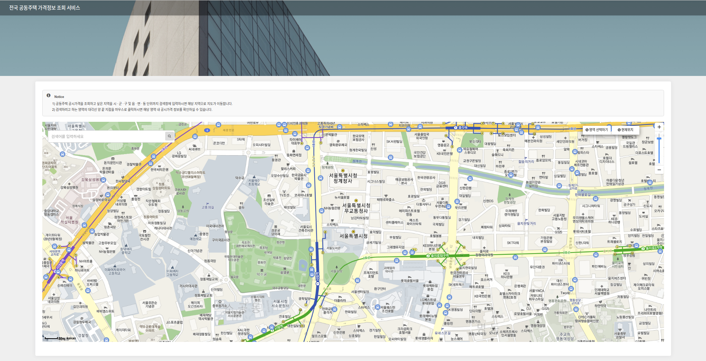

# public-land-value
공시지가 검색


### 목차

------

#### [1. 준비](https://github.com/startupcloudplatform/public-land-value#준비)

#### [2. MavenBuild](https://github.com/startupcloudplatform/public-land-value#mavenbuild)

#### [3. manifest.yml 작성](https://github.com/startupcloudplatform/public-land-value#manifestyml-%EC%9E%91%EC%84%B1)

#### [4. cf push](https://github.com/startupcloudplatform/public-land-value#cf-push)

#### [5. 마이크로서비스 구성 방법](https://github.com/startupcloudplatform/public-land-value#%EB%A7%88%EC%9D%B4%ED%81%AC%EB%A1%9C%EC%84%9C%EB%B9%84%EC%8A%A4-%EA%B5%AC%EC%84%B1-%EB%B0%A9%EB%B2%95)

#### [6. 최종결과화면](https://github.com/startupcloudplatform/public-land-value#%EC%B5%9C%EC%A2%85%EA%B2%B0%EA%B3%BC%ED%99%94%EB%A9%B4)

------


#### 준비

##### - Kakao 지도 Javscript API 

키 발급을 받아야 사용할 수 있습니다. 키를 발급받기 위해서는 카카오 계정이 필요합니다.

1. *[카카오 개발자사이트](https://developers.kakao.com/)* (https://developers.kakao.com) 접속
2. 개발자 등록 및 앱 생성
3. 웹 플랫폼 추가: 앱 선택 – [설정] – [일반] – [플랫폼 추가] – 웹 선택 후 추가
4. 사이트 도메인 등록: [웹] 플랫폼을 선택하고, [사이트 도메인] 을 등록합니다. (예: http://localhost:8080)
5. 페이지 상단의 [JavaScript 키]를 지도 API의 appkey로 사용합니다.
6. 앱을 실행합니다.

index.html 



[참고사이트] : http://apis.map.kakao.com/web/guide/


#### MavenBuild

각 프로젝트 폴더로 이동하여 maven 빌드를 통해 jar파일 생성

```
mvn clean package
```


#### Manifest.yml 작성

```
---
applications:
  - name: (cf에 push되는 앱 이름)
    memory: 1G
    path: (jar파일이 있는 경로)/(jar파일).jar
    buildpack: java_buildpack
    env:
      msa: yes
      private: (paasta 계정 id)
      
ex)   
---
applications:
  - name: plv-front
    memory: 1G
    path: target/plv-front-0.0.1-SNAPSHOT.jar
    buildpack: java_buildpack
    env:
      msa: yes
      private: test
```

#### CF push

 사용할 조직과 스페이스를 생성하고, target을 설정한다.

 준비해둔 manifest.yml 파일과 jar파일을 이용하여 CF에 앱을 push한다. 앱 push 후에 [MicroStudio](http://203.245.1.101:8080/login)를 이용하여 마이크로서비스 구성

```
# cf 조직 생성
cf create-org (생성할조직 이름)
ex) cf create-org sample-org

# cf 스페이스 생성
cf create-space (생성할 스페이스 이름) -o (생성된 조직 이름)
ex) cf create-space sample-space -o sample-org

# cf target 설정
cf target -o (조직이름) -s (스페이스이름)
ex) cf target -o sample-org -s sample-space

# cf에 application 배포
ex) cf push --no-start
```

#### 마이크로서비스 구성 방법

- 서비스간 연결 구조

  

- 라우팅 설정

  

- 임시


#### 최종결과화면

